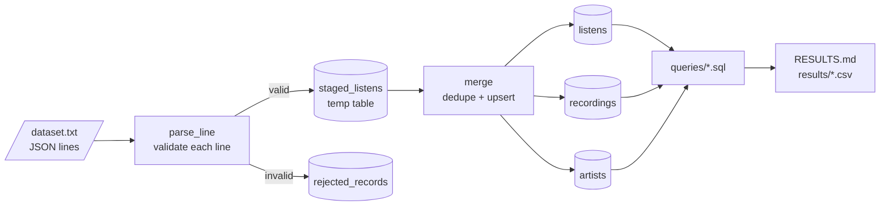

# etl-pipeline-user-analytics

[](https://github.com/abdulghaffar02/etl-pipeline-user-analytics/actions/workflows/ci.yml)

Loads a ListenBrainz listening-history export (one JSON listen per line) into DuckDB and
answers the Task 2 questions with SQL. Re-running the load is safe, and bad lines are
set aside with a reason instead of breaking the run. The answers are in [RESULTS.md](RESULTS.md).

## Quickstart (macOS)

Needs [uv](https://docs.astral.sh/uv/) (`brew install uv`). uv installs Python 3.12 and
the locked dependencies itself. DuckDB comes with the Python package, so there's no
database server to set up.

```bash
git clone https://github.com/abdulghaffar02/etl-pipeline-user-analytics.git
cd etl-pipeline-user-analytics
cp /path/to/dataset.txt data/dataset.txt
```

Then:

```bash
make setup
make pipeline
```

`make pipeline` loads the file (about 5 seconds), runs the queries, prints the results and
writes them to `RESULTS.md` and `results/*.csv`.

If `make` or `git` complains about the Xcode license, run `sudo xcodebuild -license accept` once.

## How it works



1. **Parse.** [`parse.py`](src/listens_etl/parse.py) turns one line into a `Listen` or
   raises `InvalidRecord` with a reason. The file is read in binary mode, so a line with
   broken encoding is rejected on its own.
2. **Stage.** Valid listens go into a temp table in batches of 100k (via Arrow); rejected
   lines go to `rejected_records` with their line number and reason.
3. **Merge.** [`ingest.py`](src/listens_etl/ingest.py) upserts artists and recordings,
   then inserts listens with `ON CONFLICT DO NOTHING`.
4. **Log.** Every run gets a row in `ingestion_runs` with the file's SHA-256 and counts.
   The whole run is one transaction; if it fails, nothing is loaded and the run is
   marked `failed` with the error.

```sql
SELECT run_id, status, lines_read, rows_inserted, rows_duplicate, rows_rejected
FROM ingestion_runs ORDER BY run_id;
```

### Schema

Defined in [`schema.sql`](src/listens_etl/schema.sql) and applied on every connect.

| Table / view | One row per | Key |
|---|---|---|
| `listens` | listen | `user_name, listened_at, recording_msid` |
| `recordings` | recording | `recording_msid` |
| `artists` | artist | `artist_msid` |
| `users` (view) | user, with first/last listen and count | `user_name` |
| `listens_enriched` (view) | listen, joined with track, artist and release names | |
| `ingestion_runs` | load run | `run_id` |
| `rejected_records` | unusable line | `run_id, line_number` |

## Analysis

One SQL file per question in [`src/listens_etl/queries/`](src/listens_etl/queries/):

| File | Question |
|---|---|
| `a1_top_users.sql` | Top 10 users by number of songs listened to |
| `a2_users_on_2019_03_01.sql` | How many users listened to a song on 1 March 2019 |
| `a3_first_song_per_user.sql` | First song each user listened to |
| `b_top_days_per_user.sql` | Each user's top 3 days by listens |
| `c_daily_active_users.sql` | Daily active users over a 7-day window, count and % |

```bash
make analyze                                # all queries, writes RESULTS.md and results/
uv run listens-etl analyze a1_top_users     # just one, printed
uv run listens-etl analyze --rows 50        # print more rows
```

How I read the questions:

- All dates are UTC. `listened_at` is a Unix timestamp, so UTC is the only neutral choice.
- "Songs listened to" counts every listen, repeats included.
- a3: two users played two songs within the same second as their first listen.
  ListenBrainz tags the later plays in such a group with `dedup_tag`, so that decides the order.
- b: ties on the count go to the earlier date. 19 users have fewer than 3 active days
  and get fewer than 3 rows.
- c: the percentage is out of all 202 users in the data. The first 6 days have incomplete
  windows and 2019-04-15 has only a few minutes of data; I left them in rather than hide them.

## Design decisions

Loading

- A listen is identified by `(user_name, listened_at, recording_msid)`. User and
  timestamp alone isn't enough: the export has 7,126 cases of a user playing two
  different recordings in the same second.
- Re-running is safe because of that key: the same file again inserts nothing, an
  overlapping file only adds new listens, duplicates inside a file keep the first one.
- Validation is strict for what a listen can't do without (user, timestamp, recording id,
  track, artist and artist id) and lenient for the rest: a bad `release_msid` becomes NULL
  instead of costing the listen.
- When a recording or artist shows up with different names, the one from the most recent
  listen wins, so the result doesn't depend on the order files are loaded in.
- The DuckDB session is forced to UTC. It otherwise uses the machine's timezone; on a
  machine set to Berlin time that moves listens near midnight onto the wrong day.

Schema

- Natural keys, no generated ids for data rows, so re-runs can't create new identities.
- No foreign keys: in DuckDB they slow down bulk loads and block updates to referenced
  rows. The loader keeps references consistent and a test checks for orphans.
- `listened_date` is a virtual column and `users` is a view, so neither can drift from
  `listens`.
- `additional_info` keeps only the non-empty extra keys, per listen. Only about 6% of
  listens have any, and some (`dedup_tag`, `listening_from`) describe the listen, not the track.

Analysis

- c expands each (user, active day) to the 7 days it makes the user active on, then counts
  distinct users per day. Summing daily counts over a window would count a user once for
  every day they were active in it.
- Every answer was cross-checked against a separate plain-Python calculation over the raw file.

## Trade-offs and what I'd do next

- **Parsing speed.** Parsing happens in Python so each line is validated on its own. I
  also tried parsing in DuckDB with `json_transform`: 2.4x faster (1.6s vs 4.0s here,
  roughly 8 vs 20 minutes extrapolated to 100M lines), but a single unexpected value can
  fail a whole batch. For the full ListenBrainz dump I'd switch, with `TRY_CAST` everywhere.
- **DuckDB's own `read_json(ignore_errors=true)`** took 0.1s, but it loaded 31 of 35
  deliberately broken test lines as if they were valid and dropped the rest without a
  trace, so I didn't use it.
- **Skipping known files.** The file hash is recorded but not used to skip a file that was
  already loaded. Re-processing takes seconds and is guaranteed correct; skipping would
  need a `--force` flag and an extra code path.
- **At a larger scale** I'd materialise `users` as a table, partition listens by date,
  and run the load from an orchestrator with alerting on the reject rate.
- **Not done:** a Docker image, type checking in CI, a chart of daily active users.

## Project layout

```
src/listens_etl/
  cli.py           listens-etl command: init-db, ingest, analyze
  parse.py         one line -> Listen or InvalidRecord
  ingest.py        stage, merge, run log
  db.py            connection (UTC) and schema
  schema.sql
  queries/*.sql    one file per Task 2 question
  analysis.py      runs the queries
  report.py        writes RESULTS.md
  config.py        database path: --db, then $LISTENS_DB, then data/listens.duckdb
tests/             pytest, small hand-built exports in each test
results/           generated CSVs, one per query
RESULTS.md         generated answers
```

## Setup details

### Commands

| make | Plain command | Purpose |
|---|---|---|
| `make setup` | `uv sync && uv run pre-commit install` | Install deps and git hooks |
| `make init-db` | `uv run listens-etl init-db` | Create the database and tables |
| `make ingest` | `uv run listens-etl ingest data/dataset.txt` | Load the export (`FILE=...` for another file) |
| `make analyze` | `uv run listens-etl analyze --out results --markdown RESULTS.md` | Run the queries, write results |
| `make pipeline` | ingest, then analyze | Everything in one go |
| `make test` | `uv run pytest` | Run tests |
| `make lint` | `uv run ruff check . && uv run ruff format --check .` | Lint and format check |
| `make fmt` | `uv run ruff check --fix . && uv run ruff format .` | Auto-fix and format |
| `make check` | lint, then test | What CI runs |
| `make requirements` | see Makefile | Regenerate `requirements*.txt` (the pre-commit hook does this too) |
| `make clean` | | Remove `.venv`, caches, local database |

The database lives at `data/listens.duckdb`. Use `--db PATH` or `LISTENS_DB` to put it
somewhere else (the flag wins).

### Linux and Windows

Same commands. Without `make` (usually the case on Windows), use the plain commands above.

### Without uv

Needs Python 3.11+. Installs the same pinned, hash-checked versions as `uv.lock`; the
`requirements*.txt` files are generated from it.

```bash
python3 -m venv .venv
source .venv/bin/activate          # Windows: .venv\Scripts\activate
python -m pip install --upgrade pip
pip install -r requirements-dev.txt    # runtime only: requirements.txt
pip install -e . --no-deps
pytest
```

## Contributing

- `main` is protected: no direct pushes, changes land through squash-merged PRs.
- Branch names start with `feat/`, `fix/`, `chore/`, `docs/`, `test/` or `ci/`.
- Commit messages follow [Conventional Commits](https://www.conventionalcommits.org).
- The pre-commit hooks run ruff and refuse commits to `main`.
- CI runs on every PR, and all jobs must pass before merging:
  - `lint`: ruff, and a check that `requirements*.txt` match `uv.lock`
  - `test`: pytest on macOS, Ubuntu and Windows
  - `pip-fallback`: the "Without uv" steps, on macOS
- Dependabot opens weekly PRs for GitHub Actions and Python dependencies.
